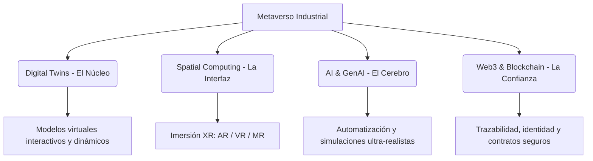
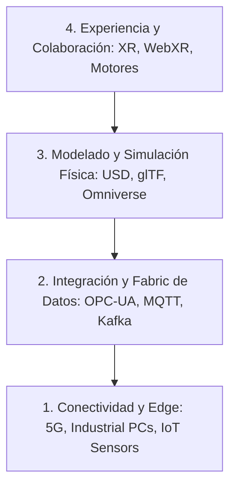

# Investigación Exhaustiva: El Impacto del Metaverso Industrial
*Un análisis estratégico basado en el Blueprint del Foro Económico Mundial (WEF) 2024*

El **Metaverso Industrial** representa la convergencia definitiva entre el mundo físico y el digital. A diferencia de las aplicaciones enfocadas en el consumidor (como el entretenimiento o el gaming), el metaverso industrial está diseñado para modelar, simular, optimizar e interactuar de forma bidireccional con sistemas complejos del mundo real, como plantas de producción, cadenas de suministro, redes energéticas y ciudades inteligentes. 

Según el Foro Económico Mundial (WEF) en su reporte seminal *"Navigating the Industrial Metaverse: A Blueprint for Future Innovations"* (2024), este segmento está en vías de convertirse en un mercado global de **$100 mil millones de dólares para el año 2030**, superando con creces el valor combinado del metaverso de consumo y empresarial básico.

---

## 1. Tecnologías Habilitadoras (Los Cuatro Pilares)

El metaverso industrial no es una tecnología única, sino un **"sistema de sistemas"** que surge de la convergencia de cuatro pilares tecnológicos clave:

1. **Digital Twins (Gemelos Digitales):** Son el bloque de construcción fundamental. No son simples modelos 3D estáticos, sino representaciones dinámicas y en tiempo real de objetos físicos, procesos o sistemas completos que se retroalimentan bidireccionalmente con sensores IoT.
2. **Spatial Computing (Computación Espacial / XR):** Engloba las tecnologías de Realidad Aumentada (AR), Realidad Virtual (VR) y Realidad Mixta (MR). Permiten a los operarios, ingenieros y diseñadores interactuar de forma natural y espacial con la información digital superpuesta en el mundo físico.
3. **Inteligencia Artificial (AI) y GenAI:** La IA actúa como el motor analítico y predictivo, permitiendo realizar simulaciones de escenarios complejos (ej. dinámicas de fluidos, fatiga de materiales) y automatizar la generación de layouts u optimizaciones operativas en segundos.
4. **Web3 y Blockchain:** Proporcionan la infraestructura de confianza, garantizando la trazabilidad de datos, la gestión segura de activos intelectuales en la nube y la identidad descentralizada en ecosistemas colaborativos multipatrón.

---

## 2. Aplicaciones en el Ciclo de Vida Industrial

El Blueprint del WEF estructura las aplicaciones del metaverso industrial en tres grandes fases dentro del ciclo de vida de los productos y plantas de fabricación:

### A. Fase de Pre-Producción (R&D y Diseño Virtual)
*   **Prototipado Virtual y R&D Colaborativo:** Los equipos de ingeniería globales pueden diseñar de forma conjunta maquinaria compleja en un espacio virtual compartido, eliminando la necesidad de múltiples prototipos físicos costosos.
*   **Simulación Completa de Fábricas (Factory Layouts):** Antes de colocar un solo ladrillo o comprar maquinaria, se simula el flujo completo de materiales, la colocación de robots industriales y los análisis de colisión/ergonomía.
    *   *Ejemplo clave:* **BMW** y **Mercedes-Benz** utilizan plataformas de simulación abierta como *Nvidia Omniverse* para diseñar virtualmente sus líneas de ensamblaje en todo el mundo.

### B. Fase de Producción (Operaciones y Optimización)
*   **Monitoreo en Tiempo Real y Operación Remota:** A través de gemelos digitales conectados a sistemas SCADA e IoT, los operadores pueden diagnosticar, ajustar y controlar plantas industriales enteras desde cualquier lugar del planeta.
*   **Capacitación Inmersiva (XR-Training):** Los trabajadores pueden entrenarse en entornos de alta fidelidad para realizar tareas peligrosas o de alta precisión sin desperdiciar recursos físicos ni poner en riesgo su integridad.
*   **Mantenimiento Predictivo y Asistido:** Superposición de guías de reparación en Realidad Aumentada (AR) sobre máquinas físicas reales para los técnicos en campo, reduciendo los tiempos de inactividad de forma drástica.

### C. Fase de Post-Producción (Post-Venta y Experiencia de Cliente)
*   **Showrooms y Demostraciones Virtuales:** Permiten a los clientes explorar y configurar productos complejos (como vehículos industriales o turbinas) de manera inmersiva antes de la entrega.
    *   *Ejemplo clave:* **SEAT** y otras marcas automotrices han desarrollado showrooms hiperrealistas en entornos virtuales 3D interactivos.
*   **Servicio Técnico Remoto Avanzado:** Ingenieros senior guían virtualmente a técnicos locales a través de gemelos digitales idénticos para resolver averías complejas en destino.

---

## 3. Ventajas Competitivas y Beneficios Medibles

Las organizaciones líderes que han comenzado a adoptar el metaverso industrial reportan beneficios cuantitativos de alto impacto:

> [!TIP]
> - **Reducción de Costos de Diseño:** Las simulaciones virtuales reducen los costos asociados al diseño y prototipado físico hasta en un **70%**.
> - **Detección de Errores Temprana:** La capacidad de probar layouts e integraciones de software en gemelos virtuales antes del despliegue en campo mejora la detección de errores de planificación en un **78%**.
> - **Reducción del Time-to-Market:** Agiliza los plazos de desarrollo de productos nuevos hasta en un **50%**, permitiendo una respuesta mucho más rápida ante cambios en el mercado.
> - **Eficiencia Energética:** La simulación detallada de flujos de calor, refrigeración y cargas eléctricas optimiza el consumo de energía en plantas fabriles, reduciendo la huella de carbono operacional hasta un **15-20%**.

---

## 4. Implicaciones y Consecuencias a Futuro

El despliegue masivo del metaverso industrial no está exento de desafíos y redefinirá la industria en la próxima década:

### I. La Batalla por la Interoperabilidad
Para que el metaverso industrial funcione, los sistemas deben poder comunicarse sin barreras. Esto requiere el desarrollo y adopción de estándares de datos abiertos (como **USD - Universal Scene Description** de Pixar/Nvidia, o estándares del *W3C* e *Industrial Metaverse Consortium*). Las empresas deben evitar a toda costa los silos de datos y los ecosistemas cerrados y propietarios.

### II. Reskilling y Upskilling de la Fuerza Laboral
El perfil del trabajador industrial está cambiando drásticamente. Se requerirá capacitar a la fuerza laboral actual para interactuar con sistemas de datos inmersivos, gemelos digitales y sistemas de IA en tiempo real. Esto fomenta una colaboración más estrecha entre perfiles tradicionales de ingeniería mecánica y especialistas en desarrollo de software y computación espacial.

### III. Ciberseguridad y Soberanía de los Datos
Al conectar los gemelos digitales de infraestructura crítica (redes de agua, plantas químicas, automotrices) a internet para permitir el flujo bidireccional, aumenta de forma crítica la superficie de ataque cibernético. La seguridad desde el diseño (*security-by-design*) y la encriptación avanzada serán imperativas para proteger los secretos industriales de propiedad intelectual y los activos estatales.

### IV. Innovación Humano-Céntrica y Sostenible
El WEF hace hincapié en que el metaverso industrial debe diseñarse con una mentalidad orientada a la **sostenibilidad y equidad**. Las simulaciones virtuales deben utilizarse no solo para maximizar el retorno de inversión (ROI), sino para minimizar la generación de residuos físicos, optimizar el uso de recursos naturales no renovables y crear entornos laborales más seguros y ergonómicos para los trabajadores de campo.

---

## 5. Arquitectura Técnica de Integración (IT/OT) y Protocolos Requeridos

La creación y operación en tiempo real del metaverso industrial requiere una infraestructura robusta que conecte el entorno operativo físico (OT) con los sistemas lógicos digitales (IT).

### A. Capas de la Arquitectura del Metaverso Industrial

1. **Capa de Conectividad y Edge:** Sensores IoT, PLCs y PCs industriales con GPUs de nivel edge que capturan y procesan datos del mundo físico en milisegundos.
2. **Capa de Datos (Data Fabric):** Traduce y unifica la telemetría utilizando protocolos industriales abiertos como **OPC-UA** (para el contexto semántico seguro en planta) y **MQTT / Sparkplug B** (para la transmisión de eventos ligera y de alta frecuencia a la nube).
3. **Capa de Modelado y Simulación:** Donde se estructuran las representaciones 3D. Utiliza **USD (Universal Scene Description)** como formato modular estándar ("el HTML del 3D") para permitir el diseño y simulación física colaborativa y **glTF** para el envío rápido de assets ligeros.
4. **Capa de Aplicación y Experiencia:** Visualización en tiempo real mediante motores como **NVIDIA Omniverse** (completamente nativo de USD), **Unity** o **Unreal Engine**, acoplados a interfaces **OpenXR / WebXR** para dar soporte multiplataforma a dispositivos de Realidad Virtual y Mixta.

---

## 6. Casos de Uso de Vanguardia (Nuevas Fuentes)

*   **PepsiCo y Digital Twin Composer:** La compañía utiliza el ecosistema integrado de *Siemens Xcelerator* y *NVIDIA Omniverse* para crear réplicas digitales completas de sus almacenes y centros logísticos. A través del gemelo digital, preveen e identifican hasta el **90%** de las colisiones y cuellos de botella operativos en el flujo de materiales antes de iniciar la construcción física, optimizando el CAPEX en millones de dólares.
*   **BMW Group y Simulaciones Aerodinámicas 30x:** Utilizando las herramientas de simulación de fluidos avanzadas de Siemens (*Simcenter Star-CCM+*) aceleradas por la potencia gráfica de NVIDIA, lograron acelerar las simulaciones aerodinámicas y de resistencia de sus nuevos vehículos en un **factor de 30x** (30 veces más rápido), lo cual reduce significativamente el consumo de energía en R&D y los costos de desarrollo.
*   **HD Hyundai (Construcción Naval de Gran Escala):** La firma de astilleros utiliza la integración de Siemens y NVIDIA para gestionar sets de datos masivos correspondientes al diseño CAD de buques gigantes, permitiendo a cientos de ingenieros interactuar simultáneamente dentro del modelo virtual fotorrealista para validar soldaduras, tuberías e instalaciones.

---

## 7. Conclusión y Hoja de Ruta para Líderes

El metaverso industrial ya no es una hipótesis de ciencia ficción; es una realidad operativa implementada por gigantes de la tecnología, la automoción y la logística como **Mercedes-Benz, BMW y Amazon** para perfeccionar sus cadenas de valor globales. 

Para las organizaciones que deseen iniciar su camino de adopción, el WEF propone tres pasos fundamentales:
1. **Definir un Caso de Uso Concreto:** Comenzar con un gemelo digital a pequeña escala enfocado en resolver un cuello de botella específico en lugar de intentar virtualizar toda la organización de inicio.
2. **Priorizar Estándares Abiertos:** Asegurarse de que cualquier inversión tecnológica admita la interoperabilidad futura y no bloquee los datos del negocio en proveedores únicos.
3. **Colaborar e Involucrar a la Fuerza Laboral:** Integrar a los operarios de campo en el diseño de las interfaces de computación espacial para asegurar que la tecnología realmente empodere a las personas.
